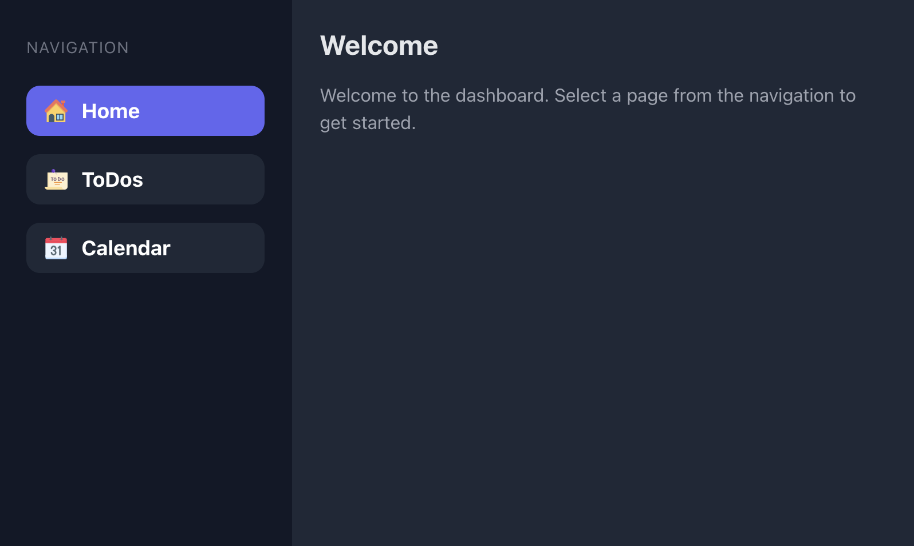

# Smart Home Display (Frontend)

> Simple smart home screen frontend. It is a static web application that can be run on a Raspberry Pi or any other device that can run a web server. To prevent CORS issues you need to run the included proxy server.

You can customize the modules by setting up the desired .env variables. 

## Features

This project includes the following modules which you can enable or disable by setting the corresponding .env variables:

- Home Screen
- Todoist Overview
- Calendar (ICS) Overview

## Installation

1. Clone the repository
2. Run `yarn` to install the dependencies
3. Create a `.env` file in the root directory by copying the `.env.example` file

## Configuration

The `.env` file contains the following variables:

### `REACT_APP_TODOIST_API_KEY`

Set this variable to your Todoist API key to enable todoist integration.

### `REACT_APP_CALENDAR_WEBCAL_URLS`

Set this variable to a define a webcal URL to enable calendar integration.

## Build

Run `yarn build` to build the project. The build artifacts will be stored in the `build/` directory.

## Run

Run `yarn serve` to start the proxy server and serve the static files (e.g. on your raspberry pi).