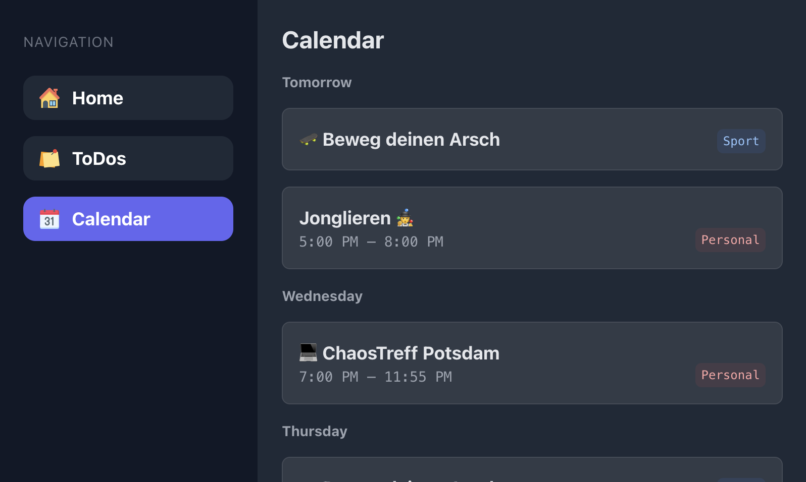

# Smart Home Display (Frontend)

> Customizable static web app that can be run on a Raspberry Pi or any other device to show useful data like calendar or todoist infos.

## Features

This project includes the following modules which you can enable or disable by setting up the corresponding .env variables:

- Home Screen
  - does nothing currently except showing the welcome message
- Todoist Overview
  - shows all uncompleted tasks and sub tasks
- Calendar (ICS) Overview
  - shows events of the next 7 days

Currently the app automatically rotates through the modules every ~ 30 seconds and scrolls through the content if it is too long to fit on the screen.

> ⚠️ More modules will be added in the future. Feel free to contribute!

## Installation

1. Clone the repository
2. Run `yarn` to install the dependencies
3. Create a `.env` file in the root directory by copying the `.env.example` file

## Configuration

The `.env` file contains the following variables:

### `REACT_APP_API_PORT`

Set this variable to the port of the backend server. The backend server is used to fetch the data from the external APIs (e.g. ics calendar data).

### `REACT_APP_TODOIST_API_KEY`

Set this variable to your Todoist API key to enable todoist integration. If not set, the todoist module will be disabled.

### `REACT_APP_CALENDAR_WEBCAL_URLS`

Set this variable to a define one or multiple webcal URLs to enable the calendar integration. 

### `REACT_APP_CALENDAR_WEBCAL_NAMES`

Set this variable to define the names of the calendars. The names should be separated by a comma and the order should match the order of the URLs in `REACT_APP_CALENDAR_WEBCAL_URLS`.

### `REACT_APP_CALENDAR_WEBCAL_COLORS`

Supported colors:

`red`,`orange`,`amber`,`yellow`,`lime`,`green`,`emerald`,`teal`,`cyan`,`sky`,`blue`,`indigo`,`violet`,`purple`,`fuchsia`,`pink`,`rose`,`slate`,`gray`,`zinc`,`neutral`, `stone`

Set this variable to define the colors of the calendars. The colors should be separated by a comma and the order should match the order of the URLs in `REACT_APP_CALENDAR_WEBCAL_URLS`.

## Build

Run `yarn build` to build the project. The build artifacts will be stored in the `build/` directory.

## Run

Run `yarn serve` to start the proxy server and serve the static files (e.g. on your raspberry pi). The app will be available at `http://localhost:3000`.

On crash the app will automatically restart by the help of `nodemon`.

## Autostart / Systemd Service

To run the built app on a Raspberry Pi or any other device you can setup a systemd service. You can use the example service files from the `systemd-service` directory.

1. Copy the `kiosk.service` file to `/etc/systemd/system/`
2. Make sure to setup the systemd paths correctly in the `kiosk.service` file
3. Run `sudo systemctl enable kiosk.service` to enable the service
4. Run `sudo systemctl start kiosk.service` to start the service
5. Run `sudo systemctl status kiosk.service` to check the status of the service
6. To stop the service run `sudo systemctl stop kiosk.service`